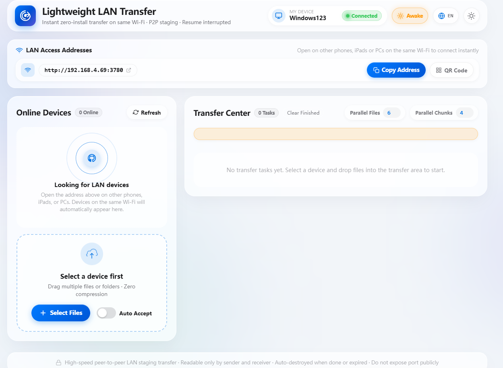
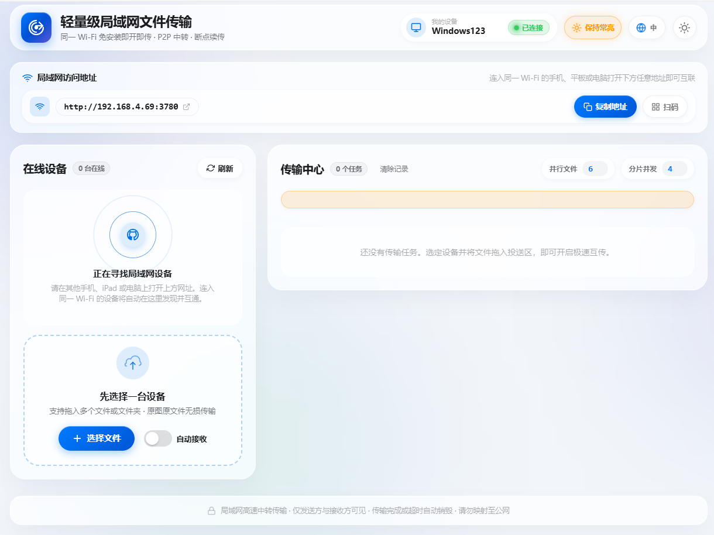
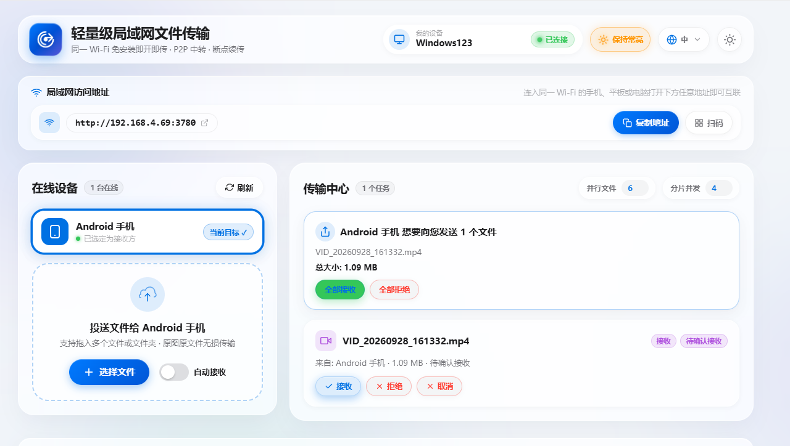
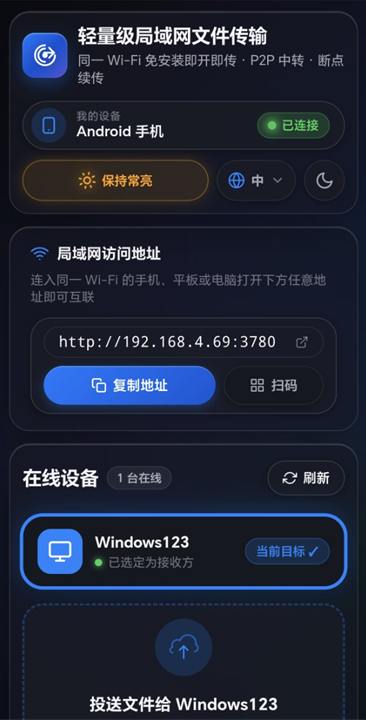
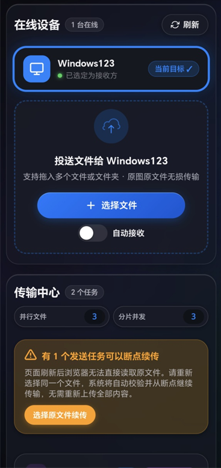

# ⚡ 轻量级局域网文件传输 (Lightweight LAN Transfer)

[](https://nodejs.org/)
[](LICENSE)
[](#)
[](#)

> **极速多文件并发 · 可靠分片断点续传 · 跨平台零安装 · 原生 iOS 26 空间流体美学**

无需连接数据线、无需登录第三方账号、无需在各个设备上下载安装繁重的客户端。只要在同一局域网（同一 Wi-Fi）下，任意设备打开浏览器即可互相发现并极速互传文件。

支持在 **Windows、macOS、Linux、iPhone/iPad (iOS)、Android 手机、平板** 等所有现代浏览器之间无缝流通。采用可靠的 Node.js 分片流式暂存与断点续传架构，彻底解决传统直连链路遇网络波动即中断、无法恢复进度的痛点。

---

## 📸 界面预览 (Screenshots)

### 🖥️ 桌面端体验 (Desktop View)

| 英文浅色模式 (English Light) | 中文浅色模式 (Chinese Light) |
| :---: | :---: |
|  |  |

| 实时传输中心与投送请求 (Transferring & Incoming) |
| :---: |
|  |

---

### 📱 移动端自适应 (Mobile View - Dark Mode)

| 移动端顶部状态与扫码快速连接 | 投送控制面板与断点续传保障 |
| :---: | :---: |
|  |  |

---

## ✨ 核心特性 (Key Features)

- 🎨 **iOS 26 空间流体美学 (Liquid Glass)**
  - 深度定制 Apple 风格液态玻璃与柔和毛玻璃效果，光晕微光流转。
  - 完美适配**明亮模式 / 暗黑模式**（支持系统自适应与一键手动切换）。
  - 顶部动态灵动岛（Dynamic Island）操作轻提示，优雅不打扰。

- ⚡ **多文件并发 & 分片极速互传**
  - 支持批量拖拽多个文件或文件夹投送。
  - **并行文件**（1～6）与**分片并发**（1～4）支持在界面滑动调节，充分榨干千兆局域网与 Wi-Fi 6 吞吐能力。

- 🔄 **真正可靠的分片断点续传 (Resume Interrupted Transfers)**
  - 基于文件 Hash 粒度的高效分片记录。
  - 若传输过程中网络闪断、意外刷新网页或服务端重启，再次选取同名原文件，**自动校验缺口切片并无缝秒级续传**，绝不重新上传已有内容。

- 📱 **屏幕常亮保活 (WakeLock)**
  - 原生集成现代 `navigator.wakeLock` 机制（配备静音内联视频双保活回退）。
  - 大文件传输期间防止移动端息屏锁定或电脑自动休眠，有效避免后台被系统杀掉连接。

- 🌐 **多语言国际化 (i18n)**
  - 原生支持 **简体中文** 与 **English** 一键下拉无缝切换。
  - 语言偏好自动本地持久化存储。

- ⚡ **自动接收模式 (Auto Accept)**
  - 可开启「自动接收」开关。在个人多台设备间投送文件时，无需每次在接收端手动点击确认，静默自动接收。

- 📷 **局域网自动识别与扫码快连 (QR Code Connect)**
  - 服务端启动自动枚举所有可用网卡 IP 地址并直接呈现。
  - 界面提供一键复制访问网址；集成遵循 ISO/IEC 18004 标准的扫码弹窗，手机平板相机一扫即连。

- 🛡️ **私密安全与自动销毁 (Privacy & Auto Cleanup)**
  - 点对点传输令牌保护，仅同一任务的发送方与接收方可读取文件。
  - 暂存文件到期自动清理（未完成任务默认保留 12 小时，已完成保留 6 小时），不留垃圾占用磁盘。
  - 专为局域网可信环境设计，无需暴露公网端口。

- 📲 **移动端与内置浏览器深度兼容**
  - 针对国内深度定制系统（小米/HyperOS 自带浏览器、微信内置 WebView、QQ 浏览器、UC、夸克）进行底层加固。
  - 注入 Web App 运行模式声明，强力禁用浏览器的“智能拼页”与图层嗅探劫持。

---

## 🚀 快速启动 (Quick Start)

### 环境要求
- [Node.js](https://nodejs.org/) `>= 18.0.0`

### 1. 克隆与安装
```bash
git clone https://github.com/your-username/filetransporter.git
cd filetransporter
npm install
```

### 2. 启动服务
```bash
npm start
```
> **Windows 用户**：也可直接双击目录下的 `start.bat` 一键运行。

### 3. 访问与互联
启动后，终端将输出访问地址，例如：
```text
局域网文件传输已启动
本机打开: http://127.0.0.1:3780
手机、其他电脑、Mac 请打开下面任一地址（需在同一局域网）:
  http://192.168.x.x:3780
暂存目录: <当前项目根目录>/data
按 Ctrl+C 停止服务。
```

- **本机电脑**：直接在浏览器访问 `http://127.0.0.1:3780`
- **手机 / 其他电脑 / 平板**：打开同一 Wi-Fi 下的局域网 IP（例如终端输出的 `http://192.168.x.x:3780`），或在电脑端点击 **「扫码」** 使用手机相机扫码即可直接开启传输。

---

## 📖 使用指南 (Usage Guide)

1. **设备发现**：
   - 确保双方设备连接在同一个 Wi-Fi 或局域网路由器下。
   - 打开网页后，双方的设备卡片会自动出现在「在线设备」区域（例如 `Windows123`、`Android 手机`）。
   - 可以在页面顶栏点击「我的设备」自由修改设备昵称。
2. **选择目标与文件**：
   - 在发送端点击选中目标设备（显示「当前目标 ✓」）。
   - 拖拽文件到虚线投送区，或点击 **「＋ 选择文件」** 挑选一个或多个文件。
3. **确认接收**：
   - 接收端屏幕将弹出清晰的投送请求通知（显示发送方、文件清单与总大小）。
   - 点击 **「✓ 全部接收」**（或单个文件的「接收」），多文件开始飞速并发传输。
   - 若常用自己的设备，可提前开启 **「自动接收」** 开关，省去每次手动确认。
4. **保存入库**：
   - 传输完成即自动校验完整性并提供「保存到本地」按钮。

### 🔁 断点续传说明
- **发送中断 / 页面误刷新**：页面顶部会自动出现橙色提示栏 **「有发送任务可以断点续传」**，点击按钮重新选择同一文件，系统自动匹配缺口分片，直接从断点处继续往后传。
- **接收中断**：重新打开网页，若文件在服务器有效期内，将从本地缓存记录的偏移位置自动继续拉取。

---

## 🛠️ 配置说明 (Environment Variables)

可通过在启动命令前注入环境变量来自定义服务行为：

| 环境变量 | 默认值 | 说明 |
| :--- | :--- | :--- |
| `PORT` | `3780` | HTTP 与 WebSocket 监听端口 |
| `HOST` | `0.0.0.0` | 监听地址（绑定 `0.0.0.0` 允许局域网外部设备访问） |
| `DATA_DIR` | `data` | 分片暂存与设备令牌数据持久化目录 |
| `CHUNK_SIZE` | `4194304` (4MB) | 默认单分片大小（字节） |
| `MAX_CHUNK_SIZE` | `8388608` (8MB) | 单个请求最大允许的分片体积 |
| `MAX_FILE_SIZE` | `50GB` | 单个上传文件的最大体积上限 |
| `MAX_TOTAL_SIZE` | `100GB` | 当前有效任务的总存储体积上限 |
| `TTL_HOURS` | `12` | 未完成传输任务在磁盘上的最长保留时间（小时） |
| `READY_TTL_HOURS` | `6` | 已完成但未被清理的任务保留时间（小时） |

#### 自定义端口启动示例：
- **PowerShell (Windows)**:
  ```powershell
  $env:PORT = "3800"; npm start
  ```
- **Bash (macOS / Linux)**:
  ```bash
  PORT=3800 npm start
  ```

---

## ❓ 常见问题排查 (Troubleshooting)

### 1. 手机打不开电脑上的地址？
- **检查同一 Wi-Fi**：手机必须与电脑处于同一路由器网络。如果连接的是公共场所或公司的**访客 Wi-Fi**（Guest Wi-Fi），路由器通常开启了“**AP 隔离**”（设备之间无法互访），请连接普通工作网络。
- **防火墙端口拦截**：Windows Defender 防火墙可能拦截外部入站请求。请以管理员身份打开 PowerShell 执行：
  ```powershell
  New-NetFirewallRule -DisplayName "LAN File Transfer" -Direction Inbound -Protocol TCP -LocalPort 3780 -Action Allow
  ```
- **不要使用 127.0.0.1**：`127.0.0.1` 仅代表设备自身。手机必须访问终端或网页顶栏显示的实际局域网 IP（如 `http://192.168.x.x:3780`）。

### 2. 手机自带浏览器排版有误或旧样式残留？
- 项目已集成 `no-cache, must-revalidate` 策略与版本哈希标签。若遇到手机内核缓存旧样式，**下拉刷新**或在浏览器设置中清除该站点历史缓存后重新打开即可。

---

## 🧪 自动化测试 (Testing)

项目采用 Node.js 原生测试运行器，覆盖合并校验、分片乱序并发、服务重启续传、多文件并行、WebSocket 广播及磁盘清理：

```bash
npm test
```

---

## 📄 开源许可证 (License)

本项目基于 [MIT 许可证](LICENSE) 开源。欢迎提交 Issue 与 Pull Request！